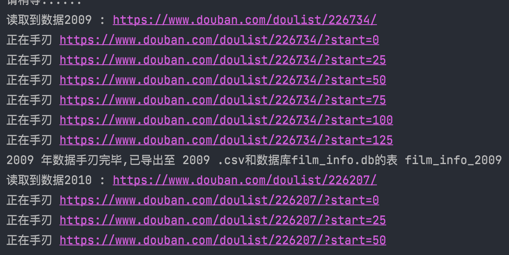

# Python_FilmInfo_reptile
#### 爬取豆瓣上2009-2021年共13年的年度电影排行榜数据，可全自动爬取，爬取内容如下:

- 电影名称
- 电影分类
- 电影上映日期
- 电影票房

---

#### 源码中默认是爬取2009-2021所有年份的信息，如只需要部分年份，只需注释掉 `line 63-68`，将`line 71-83`中需要的年份取消注释即可。

